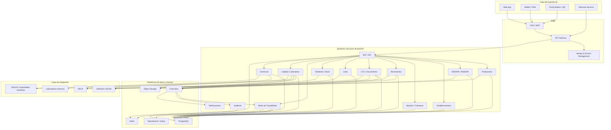

````md
# Arquitectura Técnica — Sistema de Trazabilidad Apícola en Argentina

**Versión:** 1.0  
**Fecha:** 2026-08-25  
**Tipo:** Documento de arquitectura técnica  
**Objetivo:** definir una arquitectura escalable, segura e interoperable para una plataforma de trazabilidad apícola en Argentina.

---

## 1. Propósito

Este documento define una arquitectura de referencia para una plataforma que permita registrar, consultar y relacionar información de trazabilidad apícola.

La arquitectura se basa en un principio fundamental:

> **La plataforma debe tener un modelo de dominio propio y actuar como capa de gestión e interoperabilidad, sin reemplazar las fuentes oficiales.**

El ecosistema argentino involucra distintos registros, organismos y sistemas. Entre ellos se encuentran **RENSPA, RENAPA, SENASA/SIGSA, DT-e, ARCA y SIFeGA**, cada uno con responsabilidades diferentes.

En particular, el modelo debe distinguir claramente:

```text
RENSPA
   ↓
Establecimiento / ubicación productiva

RENAPA
   ↓
Registro de la actividad apícola

SIGSA
   ↓
Gestión sanitaria y movimientos oficiales

DT-e
   ↓
Documento asociado a determinados movimientos

SIFeGA
   ↓
Información y gestión sanitaria alimentaria

ARCA
   ↓
Dimensión fiscal / tributaria
````

La plataforma propuesta no debe intentar convertir todos estos conceptos en una única entidad.

---

# 2. Principios arquitectónicos

La solución deberá seguir los siguientes principios:

1. **API-first**
2. **Interoperabilidad**
3. **Separación de responsabilidades**
4. **Trazabilidad basada en eventos**
5. **Auditoría completa**
6. **Seguridad por diseño**
7. **Identificadores internos independientes de los oficiales**
8. **Idempotencia en integraciones**
9. **Observabilidad**
10. **Escalabilidad horizontal**
11. **Evolución progresiva**
12. **No acoplamiento directo con organismos externos**
13. **Configuración de reglas de negocio**
14. **Historial inmutable de eventos críticos**
15. **Capacidad de operar temporalmente sin servicios externos**

---

# 3. Arquitectura lógica por capas

La arquitectura propuesta se divide en siete grandes capas:

```text
┌───────────────────────────────────────────────┐
│ 1. EXPERIENCIA / FRONTEND                     │
│ Web · Mobile · Portal · QR                    │
└───────────────────────┬───────────────────────┘
                        │ HTTPS
┌───────────────────────▼───────────────────────┐
│ 2. EDGE / API GATEWAY                         │
│ Auth · Rate limit · Routing · Observability   │
└───────────────────────┬───────────────────────┘
                        │
┌───────────────────────▼───────────────────────┐
│ 3. APLICACIÓN / BACKEND                       │
│ APIs · casos de uso · validaciones            │
└───────────────────────┬───────────────────────┘
                        │
┌───────────────────────▼───────────────────────┐
│ 4. SERVICIOS DE DOMINIO                       │
│ Productores · RENSPA · Apiarios · Movimientos │
│ Lotes · Tambores · Trazabilidad · Auditoría   │
└───────────────────────┬───────────────────────┘
                        │
              ┌─────────┴─────────┐
              │                   │
┌─────────────▼──────────┐ ┌──────▼────────────┐
│ 5. DATOS               │ │ 6. EVENTOS        │
│ PostgreSQL · Redis     │ │ Broker / Queue    │
│ Object Storage         │ │                    │
└────────────────────────┘ └─────────┬──────────┘
                                    │
                         ┌──────────▼──────────┐
                         │ 7. INTEGRACIONES    │
                         │ SENASA / SIGSA     │
                         │ ARCA               │
                         │ SIFeGA             │
                         │ Laboratorios       │
                         └─────────────────────┘
```

---

# 4. Diagrama de alto nivel



---

# 5. Frontend

## 5.1 Tecnología recomendada

### Web

**React + TypeScript + Next.js**

### Justificación

* Ecosistema maduro.
* TypeScript permite detectar errores durante desarrollo.
* Buena separación entre presentación y lógica.
* Excelente soporte para aplicaciones web complejas.
* Posibilidad de construir portales públicos.
* Amplia disponibilidad de desarrolladores.

---

## 5.2 Aplicación móvil

Para el MVP se recomienda comenzar con:

**PWA — Progressive Web App**

en lugar de desarrollar inmediatamente aplicaciones Android e iOS independientes.

Esto permite:

* utilizar la cámara del teléfono;
* leer códigos QR;
* trabajar desde dispositivos móviles;
* reducir el costo inicial;
* reutilizar gran parte del código;
* implementar progresivamente funcionalidades offline.

Posteriormente puede evaluarse React Native si la operación de campo requiere capacidades nativas.

---

# 6. Frontends previstos

La plataforma podría evolucionar hacia los siguientes portales:

```text
Portal Productor
Portal Sala de Extracción
Portal Transportista
Portal Acopiador
Portal Fraccionador
Portal Laboratorio
Portal Exportador
Portal Administrador
Portal Auditor
Portal Consulta Pública
```

No necesariamente deben ser aplicaciones independientes.

Inicialmente pueden formar parte de una misma aplicación con autorización basada en roles.

---

# 7. API Gateway

El API Gateway será el punto de entrada de las APIs externas.

## Responsabilidades

* TLS termination.
* Autenticación.
* Autorización inicial.
* Rate limiting.
* Routing.
* CORS.
* Versionado.
* Logging.
* Correlation ID.
* Protección contra abuso.

## Tecnologías recomendadas

* Kong Gateway.
* Traefik.
* NGINX.

Para el MVP puede utilizarse una arquitectura más simple si el volumen no justifica un Gateway dedicado.

---

# 8. Identidad y seguridad

## Tecnología recomendada

**Keycloak**

Permite implementar:

* OpenID Connect.
* OAuth 2.0.
* Single Sign-On.
* Roles.
* Grupos.
* MFA.
* Federación de identidades.

Modelo:

```text
Usuario
   ↓
Keycloak
   ↓
Access Token
   ↓
API Gateway
   ↓
Servicio
```

---

# 9. Roles iniciales

Se recomienda comenzar con:

```text
ADMIN
PRODUCTOR
SALA
TRANSPORTISTA
ACOPIADOR
FRACCIONADOR
LABORATORIO
EXPORTADOR
AUDITOR
CONSULTA
```

Posteriormente pueden incorporarse roles institucionales específicos.

---

# 10. Backend

## Tecnología recomendada

**Java 21 + Spring Boot**

Alternativa:

**ASP.NET Core / .NET**

Java + Spring Boot es una opción especialmente adecuada por:

* madurez empresarial;
* seguridad;
* soporte de APIs;
* transacciones;
* mensajería;
* observabilidad;
* disponibilidad de desarrolladores;
* ecosistema amplio.

---

# 11. Arquitectura interna del backend

Cada módulo debería seguir una estructura similar a:

```text
API
 ↓
Application
 ↓
Domain
 ↓
Infrastructure
```

Ejemplo:

```text
movement-module/

    api/
    application/
    domain/
    infrastructure/
```

Esto evita colocar toda la lógica de negocio dentro de los controladores.

---

# 12. Microservicios

No se recomienda comenzar con decenas de microservicios.

Los límites de dominio deben diseñarse desde el comienzo, pero los módulos pueden desplegarse inicialmente como un **monolito modular**.

Posibles límites:

```text
identity
producer
establishment
apiary
movement
document
lot
inventory
traceability
audit
integration
notification
```

---

# 13. Productor Service

Responsable de:

* Productor.
* Identidad.
* CUIT.
* RENAPA.
* Contactos.
* Relaciones con establecimientos.

Ejemplo:

```text
Producer
   ├── id
   ├── name
   ├── tax_id
   ├── renapa_id
   └── status
```

---

# 14. Establishment Service

Responsable de:

* establecimientos;
* RENSPA;
* ubicaciones;
* estados;
* relaciones con productores.

Ejemplo:

```text
Establishment
   ├── id
   ├── renspa
   ├── name
   ├── location
   ├── producer_id
   └── status
```

---

# 15. Apiary Service

Responsable de:

* Apiarios.
* Colmenas.
* Ubicación.
* Estado productivo.
* Relación con establecimiento.

Modelo conceptual:

```text
Productor
    ↓
Establecimiento / RENSPA
    ↓
Apiario
    ↓
Colmenas
```

---

# 16. Movement Service

Responsable de:

* movimientos;
* origen;
* destino;
* fecha;
* cantidad;
* unidad;
* transportista;
* estado;
* eventos relacionados.

Conceptualmente:

```text
Movimiento
   ├── origen
   ├── destino
   ├── transportista
   ├── contenido
   ├── cantidad
   ├── fecha
   └── documentos
```

---

# 17. Distinción fundamental: Movimiento vs. DT-e

La arquitectura debe distinguir:

```text
MOVIMIENTO
    ≠
DT-e
```

El **Movimiento** es un concepto del dominio de la plataforma.

El **DT-e** es un documento oficial asociado a determinados movimientos.

Por lo tanto:

```text
Movimiento
    │
    ├── estado interno
    │
    └── DT-e
          ├── número oficial
          ├── estado
          ├── fecha
          └── información externa
```

Esta separación es crítica para que el sistema pueda evolucionar sin depender de la estructura de un organismo externo.

---

# 18. Document Service

Responsable de:

* DT-e;
* documentos;
* comprobantes;
* archivos;
* metadatos;
* hash;
* relaciones documento-evento.

Ejemplo:

```text
Document
   ├── id
   ├── type
   ├── external_id
   ├── number
   ├── status
   ├── object_key
   ├── hash
   └── created_at
```

---

# 19. Lot Service

Responsable de:

* lotes;
* cantidades;
* composición;
* origen;
* transformaciones;
* estados.

Ejemplo:

```text
Lot
   ├── id
   ├── code
   ├── quantity
   ├── unit
   ├── production_date
   ├── status
   └── origin
```

---

# 20. Inventory / Tambor Service

Responsable de:

* tambores;
* ubicaciones;
* stock;
* movimientos internos;
* pesos.

Ejemplo:

```text
Tambor
   ├── id
   ├── code
   ├── lot_id
   ├── gross_weight
   ├── net_weight
   ├── location_id
   └── status
```

---

# 21. Traceability Service

Este será uno de los servicios centrales.

Debe permitir:

### Trazabilidad hacia atrás

```text
Producto
   ↓
Lote
   ↓
Tambor
   ↓
Extracción
   ↓
Movimiento
   ↓
Apiario
   ↓
RENSPA
   ↓
Productor
```

### Trazabilidad hacia adelante

```text
Productor
   ↓
RENSPA
   ↓
Apiario
   ↓
Movimiento
   ↓
Lote
   ↓
Tambor
   ↓
Fraccionamiento
   ↓
Producto
```

---

# 22. Base de datos

## PostgreSQL

Es la opción principal recomendada.

### Ventajas

* ACID.
* Integridad referencial.
* Transacciones.
* JSONB.
* Índices avanzados.
* PostGIS.
* Excelente soporte para consultas complejas.
* Madurez.
* Bajo costo de licenciamiento.

---

# 23. Modelo inicial de tablas

Una estructura posible:

```text
producer
renapa
establishment
renspa
apiary
hive
movement
movement_item
movement_document
dte
lot
lot_input
drum
inventory_event
traceability_event
sample
analysis
product
audit_event
integration_event
```

---

# 24. PostGIS

Para apiarios y establecimientos se recomienda:

**PostGIS**

Permite manejar:

* coordenadas;
* geometrías;
* distancias;
* zonas;
* búsquedas geográficas.

Ejemplo:

```text
Apiary
    ├── latitude
    ├── longitude
    └── geom POINT
```

---

# 25. Redis

Se recomienda utilizar Redis para:

* cache;
* rate limiting;
* locks distribuidos;
* idempotency keys;
* información temporal;
* sesiones cuando sea necesario.

Redis **no debe ser la fuente principal de verdad de la trazabilidad**.

La información crítica debe permanecer en PostgreSQL.

---

# 26. Arquitectura orientada a eventos

La trazabilidad se beneficia de una arquitectura basada en eventos.

## Tecnologías

Para el MVP:

**RabbitMQ**

Para una plataforma de gran escala:

**Apache Kafka**

---

# 27. Eventos principales

Ejemplos:

```text
ProducerRegistered

EstablishmentRegistered

RENSPAAssociated

ApiaryRegistered

HiveRegistered

MovementCreated

MovementDispatched

MovementReceived

DteCreated

DteApproved

DteClosed

ExtractionRegistered

LotCreated

LotTransformed

DrumCreated

SampleCreated

AnalysisRegistered

InventoryMoved

ProductCreated
```

---

# 28. Event Bus

El bus permite desacoplar diferentes procesos:

```text
MovementCreated
       |
       +----> Audit Service
       |
       +----> Traceability Service
       |
       +----> Notification Service
       |
       +----> SENASA Adapter
```

Esto evita que una operación tenga que esperar a todos los procesos secundarios.

---

# 29. Object Storage

Los archivos no deberían almacenarse directamente como grandes blobs dentro de PostgreSQL.

Se recomienda:

* AWS S3;
* MinIO;
* Azure Blob Storage;
* Google Cloud Storage.

PostgreSQL almacena solamente metadatos:

```text
document_id
object_key
mime_type
hash
size
created_at
```

---

# 30. Integración con SENASA / SIGSA

La integración debe estar completamente desacoplada.

Arquitectura:

```text
Movement Service
       ↓
SENASA Adapter
       ↓
SIGSA / Servicio oficial
```

El adaptador debe manejar:

* autenticación;
* transformación;
* consulta;
* emisión cuando corresponda;
* actualización;
* errores;
* reintentos;
* auditoría.

---

# 31. Modelo de integración SENASA

El núcleo no debe conocer directamente el formato de SIGSA.

Debe existir:

```text
Modelo interno
      ↓
SENASA Adapter
      ↓
Modelo SIGSA
```

Ejemplo:

```text
Movimiento interno

movement_id
origin_establishment_id
destination_establishment_id
transport_id
date
quantity

        ↓

SENASA Adapter

        ↓

Datos requeridos por SIGSA
```

---

# 32. DT-e

El sistema deberá mantener:

```text
movement_id
dte_id
external_id
dte_number
dte_status
issued_at
closed_at
sync_status
```

Esto permite representar correctamente:

```text
Movimiento
    ↓
DT-e
    ↓
SIGSA
```

sin convertir el DT-e en la entidad principal de dominio.

---

# 33. Integración con ARCA

La integración fiscal debe estar desacoplada:

```text
Commercial Service
       ↓
ARCA Adapter
       ↓
Servicios fiscales oficiales
```

El adaptador puede encargarse de:

* autenticación;
* certificados;
* tickets;
* SOAP;
* XML;
* CAE;
* respuestas;
* errores;
* reintentos;
* contingencia.

---

# 34. Integración con SIFeGA

La integración debe seguir el mismo patrón:

```text
Quality / Food Service
          ↓
SIFeGA Adapter
          ↓
SIFeGA / Autoridad sanitaria
```

Puede contemplar información relacionada con:

* establecimientos;
* RNE;
* productos;
* RNPA;
* estados;
* información sanitaria;
* laboratorios.

La disponibilidad y alcance de los servicios dependerán de las integraciones oficiales vigentes y de las jurisdicciones involucradas.

---

# 35. Anti-Corruption Layer

Cada organismo puede utilizar modelos diferentes.

Por ello:

```text
MODELO EXTERNO
      ↓
ADAPTER
      ↓
MAPPING
      ↓
MODELO CANÓNICO
```

Ejemplo:

```text
SIGSA

renspaOrigen
renspaDestino
numeroDte

        ↓

SENASA Adapter

        ↓

Canonical Movement

movement_id
origin_establishment_id
destination_establishment_id
external_document_id
```

---

# 36. Capa de integración

La arquitectura debería tener:

```text
                CORE
                 |
          Integration Layer
                 |
      ┌──────────┼──────────┐
      │          │          │
   SENASA      ARCA      SIFeGA
   Adapter     Adapter    Adapter
```

Nunca se debería colocar código específico de un organismo dentro de los servicios de dominio.

---

# 37. Integraciones asíncronas

Cuando una operación no necesite respuesta inmediata:

```text
Usuario
  ↓
API
  ↓
Command
  ↓
Event Bus
  ↓
Integration Worker
  ↓
Organismo
```

Ventajas:

* reintentos;
* tolerancia a fallos;
* desacoplamiento;
* trazabilidad;
* procesamiento diferido.

---

# 38. Idempotencia

Las integraciones deben ser idempotentes.

Ejemplo:

```text
Idempotency-Key:
SENASA-DTE-2026-000123
```

Primera solicitud:

```text
Procesada
```

Segunda solicitud:

```text
Detectada como duplicada
```

Nunca deben generarse dos operaciones por un simple reintento de red.

---

# 39. Estados de sincronización

Las entidades relacionadas con organismos externos deberían tener:

```text
internal_status
external_status
sync_status
external_id
last_sync_at
```

Ejemplo:

```text
DT-e

internal_status = CREATED

external_status = APPROVED

sync_status = SYNCHRONIZED

external_id = XXXXX

last_sync_at = 2026-08-25T15:30:00
```

---

# 40. Escalabilidad

## 40.1 Escalabilidad horizontal

Los servicios deben ser preferentemente stateless.

```text
             Load Balancer
             /     |     \
          API-1   API-2   API-3
```

Esto permite agregar instancias sin modificar el modelo.

---

# 41. Base de datos escalable

Primera etapa:

```text
PostgreSQL Primary
```

Evolución:

```text
             PostgreSQL
             /        \
        Primary      Replica
```

Posteriormente:

* réplicas de lectura;
* particionamiento;
* archivado;
* separación de cargas;
* optimización de índices.

---

# 42. Escalabilidad de trazabilidad

Las consultas históricas pueden crecer considerablemente.

Se recomienda separar:

```text
OLTP
 ↓
PostgreSQL
```

de:

```text
Consultas / búsqueda
 ↓
OpenSearch
```

o eventualmente:

```text
Data Warehouse
```

No se deben ejecutar reportes históricos extremadamente pesados sobre las tablas transaccionales.

---

# 43. Motor de grafo

La trazabilidad tiene naturalmente una estructura de grafo:

```text
Productor
   ↓
RENSPA
   ↓
Apiario
   ↓
Movimiento
   ↓
Lote
   ↓
Tambor
   ↓
Producto
```

Para el MVP se recomienda:

```text
PostgreSQL
+
CTE recursivas
+
índices
+
eventos
```

No se recomienda introducir Neo4j desde el primer día salvo que exista una necesidad real.

Si la complejidad crece, puede incorporarse:

```text
Neo4j
```

como componente especializado.

---

# 44. Observabilidad

Tecnologías recomendadas:

* OpenTelemetry.
* Prometheus.
* Grafana.
* Loki.
* Tempo o Jaeger.

Tres pilares:

```text
Logs
Métricas
Trazas distribuidas
```

Cada request debería tener:

```text
correlation_id
trace_id
user_id
service
timestamp
```

---

# 45. Seguridad de red

Recomendaciones:

* HTTPS obligatorio.
* TLS actualizado.
* WAF.
* Firewall.
* Segmentación de redes.
* Bases de datos privadas.
* Servicios internos no expuestos públicamente.
* Principio de mínimo privilegio.

Arquitectura:

```text
Internet
   ↓
WAF
   ↓
Load Balancer
   ↓
API Gateway
   ↓
Servicios privados
   ↓
Base de datos privada
```

---

# 46. Autenticación

Se recomienda:

```text
OAuth 2.0
+
OpenID Connect
+
JWT
```

Para usuarios críticos:

```text
MFA
```

---

# 47. Autorización contextual

No basta con controlar solamente:

```text
role = PRODUCTOR
```

También debe verificarse el ámbito de acceso.

Ejemplo:

```text
Productor A
     ↓
RENSPA X
     ↓
Apiarios asociados
```

El Productor A no debería poder modificar los apiarios del Productor B.

Por lo tanto:

```text
RBAC
+
Resource Authorization
```

---

# 48. Multi-tenancy

La plataforma debería contemplar múltiples organizaciones/productores.

Una primera estrategia puede utilizar:

```text
tenant_id
```

en las entidades correspondientes.

Sin embargo, esto no debe impedir relaciones entre organizaciones.

Ejemplo:

```text
Tenant A
  RENSPA A
      ↓
   Movimiento
      ↓
  RENSPA B
Tenant B
```

---

# 49. Auditoría

La auditoría debe ser independiente de las tablas operativas.

Modelo:

```text
audit_event

id
timestamp
actor_id
action
entity_type
entity_id
before
after
source
correlation_id
```

Ejemplo:

```text
2026-08-25
USER: producer_123
ACTION: MOVEMENT_CREATED
ENTITY: movement
ENTITY_ID: abc123
SOURCE: WEB
```

---

# 50. Auditoría de integraciones

También deben auditarse las comunicaciones con organismos:

```text
integration_event

id
organization
operation
request_id
external_id
request_hash
response_hash
status
timestamp
error_code
```

No se deberían almacenar indiscriminadamente datos sensibles si no son necesarios.

---

# 51. Secretos

Las credenciales de organismos externos nunca deben almacenarse:

* en código;
* en Git;
* en archivos versionados;
* en imágenes Docker.

Utilizar:

* HashiCorp Vault;
* AWS Secrets Manager;
* Azure Key Vault;
* Google Secret Manager.

---

# 52. Disponibilidad

Objetivo inicial:

**99,5 %**

Objetivo posterior:

**99,9 %**

Pero debe diferenciarse:

```text
Sistema propio disponible
          ≠
SENASA disponible
          ≠
ARCA disponible
          ≠
SIFeGA disponible
```

---

# 53. Contingencia

Si un organismo externo no está disponible:

```text
Usuario
  ↓
Plataforma
  ↓
Guardar operación
  ↓
PENDING_EXTERNAL_SYNC
  ↓
Worker
  ↓
Reintento
  ↓
Organismo
```

El usuario debe visualizar:

```text
Estado:
Pendiente de sincronización externa
```

La operación no debe perderse.

---

# 54. Circuit Breaker

Para servicios externos se recomienda implementar:

```text
Circuit Breaker
+
Retry
+
Timeout
+
Backoff
```

Ejemplo:

```text
SENASA
  ↓
Timeout
  ↓
Retry
  ↓
Retry
  ↓
Circuit Open
  ↓
Pendiente
```

---

# 55. CI/CD

Recomendación:

* GitHub Actions o GitLab CI.
* Docker.
* pruebas automatizadas.
* análisis estático.
* SAST.
* escaneo de dependencias.
* imágenes firmadas.
* despliegue automatizado.

Pipeline:

```text
Git Push
   ↓
Build
   ↓
Unit Tests
   ↓
Integration Tests
   ↓
Security Scan
   ↓
Docker Image
   ↓
Registry
   ↓
Deploy
```

---

# 56. Entornos

Se recomienda:

```text
development
     ↓
testing
     ↓
staging
     ↓
production
```

Las integraciones con organismos deben utilizar configuraciones y credenciales separadas por ambiente.

---

# 57. Contenedores

Tecnología:

**Docker**

Ventajas:

* portabilidad;
* reproducibilidad;
* aislamiento;
* facilidad de despliegue.

---

# 58. Kubernetes

Kubernetes es recomendable cuando exista una necesidad real de:

* múltiples servicios;
* alta disponibilidad;
* autoscaling;
* despliegues frecuentes;
* múltiples nodos.

Para el MVP puede ser innecesario.

---

# 59. Arquitectura recomendada para el MVP

Una decisión importante:

> **No comenzar con una arquitectura de microservicios físicamente distribuida.**

Se recomienda:

**Monolito modular preparado para extraer servicios posteriormente.**

Arquitectura:

```text
                    API
                     |
             Modular Backend
                     |
       ┌─────────────┼─────────────┐
       │             │             │
   Producer      Movement      Traceability
       │             │             │
       └─────────────┼─────────────┘
                     |
                PostgreSQL
                     |
                 Event Bus
                     |
           Integration Worker
                     |
        ┌────────────┼────────────┐
        │            │            │
     SENASA        ARCA        SIFeGA
```

---

# 60. ¿Por qué monolito modular?

Porque permite:

* reducir complejidad;
* reducir costos;
* acelerar el desarrollo;
* simplificar debugging;
* simplificar despliegue;
* mantener transacciones locales;
* evitar problemas prematuros de consistencia distribuida.

Pero mantiene límites claros:

```text
producer
movement
lot
traceability
integration
audit
```

Cuando un módulo tenga suficiente carga o complejidad:

```text
Movement Module
       ↓
Movement Service
```

---

# 61. Arquitectura objetivo

A largo plazo:

```text
                     ┌──────────────┐
                     │  Frontends   │
                     └──────┬───────┘
                            │
                     ┌──────▼───────┐
                     │ API Gateway  │
                     └──────┬───────┘
                            │
       ┌────────────────────┼────────────────────┐
       │                    │                    │
 ┌─────▼─────┐        ┌─────▼─────┐       ┌─────▼─────┐
 │ Producer  │        │ Movement  │       │ Trace     │
 │ Service   │        │ Service   │       │ Service   │
 └─────┬─────┘        └─────┬─────┘       └─────┬─────┘
       │                    │                    │
       └────────────────────┼────────────────────┘
                            │
                     ┌──────▼───────┐
                     │ Event Bus    │
                     └──────┬───────┘
                            │
              ┌─────────────┼─────────────┐
              │             │             │
         ┌────▼────┐   ┌────▼────┐   ┌────▼────┐
         │ SENASA  │   │  ARCA   │   │ SIFeGA  │
         │ Adapter │   │ Adapter │   │ Adapter │
         └─────────┘   └─────────┘   └─────────┘
```

---

# 62. API

Se recomienda:

**REST + OpenAPI**

Ejemplos:

```http
POST /api/v1/movements

GET /api/v1/movements/{id}

POST /api/v1/movements/{id}/receive

GET /api/v1/lots/{id}

GET /api/v1/lots/{id}/trace/backward

GET /api/v1/lots/{id}/trace/forward

GET /api/v1/apiaries/{id}

GET /api/v1/establishments/{id}
```

---

# 63. Versionado

Nunca romper una API publicada sin estrategia de migración.

Ejemplo:

```text
/api/v1/
/api/v2/
```

Los cambios incompatibles deben introducir una nueva versión.

---

# 64. Contratos de integración

Cada integración debería tener su propia especificación.

Ejemplo:

```text
integration/

   senasa/
       api.yaml
       mappings.yaml
       errors.yaml
       authentication.md

   arca/
       wsaa/
       wsfe/
       mappings.yaml

   sifega/
       mappings.yaml
       errors.yaml
```

---

# 65. Reglas para el modelo canónico

El núcleo de la plataforma debería trabajar con entidades propias:

```text
Producer
Establishment
Apiary
Hive
Movement
Document
Dte
Lot
Drum
Product
Sample
Analysis
TraceabilityEvent
AuditEvent
```

Los organismos externos se representan mediante referencias:

```text
external_system
external_id
external_status
last_sync_at
```

---

# 66. Identificadores

Es fundamental separar:

### Identificador interno

```text
UUID
```

### Identificador oficial

```text
RENSPA
RENAPA
DT-e
RNE
RNPA
CUIT
```

Nunca se debe utilizar directamente un identificador oficial como primary key interna.

Modelo:

```text
Producer
------------------
id              UUID
tax_id          string
renapa_id       string
```

---

# 67. Ejemplo de identificación

```text
Producer
    id = 8b7c...

RENAPA
    code = XXXXX

Establishment
    id = 3f2a...

RENSPA
    code = XXXXX

Movement
    id = 91ac...

DT-e
    external_number = XXXXX
```

---

# 68. Trazabilidad como grafo

La arquitectura debe poder representar:

```text
                 Productor
                     |
                   RENAPA
                     |
                   RENSPA
                     |
                   Apiario
                     |
                  Colmena
                     |
                 Extracción
                     |
                    Lote
                  /     \
              Tambor   Tambor
                 \       /
                   Acopio
                     |
               Fraccionamiento
                     |
                  Producto
```

Los movimientos y documentos funcionan como eventos/documentos que conectan los nodos.

---

# 69. Escenario de ejemplo

Un productor posee un apiario.

```text
Productor P001
     ↓
RENAPA R001
     ↓
RENSPA E001
     ↓
Apiario A001
     ↓
Colmenas
```

Se obtiene miel.

```text
Apiario A001
     ↓
Movimiento M001
     ↓
DT-e D001
     ↓
Sala S001
```

Se realiza la extracción:

```text
Movimiento M001
     ↓
Extracción EX001
     ↓
Lote L001
     ↓
Tambor T001
```

Posteriormente:

```text
Lote L001
     ↓
Acopio
     ↓
Fraccionamiento
     ↓
Producto P001
```

La plataforma debe poder responder:

> ¿De qué apiarios provino este producto?

y:

> ¿Dónde terminó la miel producida por este apiario?

---

# 70. Escalabilidad funcional

La arquitectura debe permitir incorporar posteriormente:

* cera;
* propóleo;
* polen;
* jalea real;
* material vivo;
* material inerte;
* subproductos;
* exportaciones;
* certificaciones;
* producción orgánica;
* denominaciones de origen;
* análisis de laboratorio;
* alertas sanitarias.

No se recomienda diseñar el modelo exclusivamente alrededor de la miel.

---

# 71. Configuración de reglas

Las reglas regulatorias pueden cambiar.

Por ello, no se recomienda hardcodear:

```java
if (movementType == HONEY) {
    requireDte();
}
```

como única estrategia.

Es preferible utilizar reglas configurables:

```text
MovementRule

movement_type
origin_type
destination_type
requires_document
document_type
effective_from
effective_to
```

Esto permitirá versionar reglas.

---

# 72. Versionado normativo

Las reglas deberían tener vigencia:

```text
effective_from
effective_to
```

Ejemplo:

```text
Regla A
01/01/2026 → 31/07/2026

Regla B
01/08/2026 → vigente
```

Esto es importante porque la normativa puede cambiar sin que cambie la arquitectura.

---

# 73. Seguridad de datos

Debe implementarse:

* cifrado en tránsito;
* cifrado en reposo;
* backups cifrados;
* control de acceso;
* auditoría;
* gestión de secretos;
* minimización de datos;
* retención definida;
* recuperación ante desastres.

---

# 74. Backups

Estrategia recomendada:

```text
Backup diario
+
PITR
+
Replicación
+
Pruebas periódicas de restauración
```

No basta con "hacer backups".

Debe probarse regularmente:

```text
Backup
   ↓
Restore
   ↓
Validación
```

---

# 75. Recuperación ante desastre

Definir:

### RPO

Cantidad máxima de datos que se acepta perder.

### RTO

Tiempo máximo aceptable para recuperar el servicio.

Ejemplo inicial:

```text
RPO: 15 minutos
RTO: 2 horas
```

Estos valores deben validarse con los responsables del proyecto.

---

# 76. Observabilidad de organismos externos

Cada integración debe mostrar métricas:

```text
senasa_requests_total
senasa_errors_total
senasa_latency
senasa_pending_sync

arca_requests_total
arca_errors_total

sifega_requests_total
sifega_errors_total
```

Esto permitirá saber si el problema está:

```text
en nuestra plataforma
```

o:

```text
en un organismo externo
```

---

# 77. Arquitectura de seguridad resumida

```text
Internet
   ↓
WAF
   ↓
Load Balancer
   ↓
API Gateway
   ↓
IAM
   ↓
Backend
   ↓
Authorization
   ↓
Domain
   ↓
Database
```

Para organismos:

```text
Backend
   ↓
Integration Layer
   ↓
Secrets Manager
   ↓
Adapter
   ↓
Organismo externo
```

---

# 78. Decisiones tecnológicas resumidas

| Componente          | Tecnología recomendada       | Justificación                 |
| ------------------- | ---------------------------- | ----------------------------- |
| Frontend            | React + TypeScript + Next.js | Ecosistema y mantenibilidad   |
| Mobile inicial      | PWA                          | Menor costo y rápida adopción |
| Gateway             | Kong / Traefik / NGINX       | Seguridad y routing           |
| IAM                 | Keycloak                     | OIDC/OAuth2/RBAC              |
| Backend             | Java 21 + Spring Boot        | Madurez y robustez            |
| API                 | REST + OpenAPI               | Interoperabilidad             |
| BD                  | PostgreSQL                   | ACID y relaciones             |
| GIS                 | PostGIS                      | Geolocalización               |
| Cache               | Redis                        | Performance                   |
| Eventos MVP         | RabbitMQ                     | Simplicidad                   |
| Eventos escala alta | Kafka                        | Alto volumen                  |
| Archivos            | S3 / MinIO                   | Object Storage                |
| Búsqueda            | OpenSearch                   | Consultas                     |
| Observabilidad      | OpenTelemetry                | Trazabilidad técnica          |
| Métricas            | Prometheus                   | Monitoring                    |
| Dashboards          | Grafana                      | Visualización                 |
| Logs                | Loki                         | Centralización                |
| Contenedores        | Docker                       | Portabilidad                  |
| Orquestación        | Kubernetes                   | Escalabilidad                 |
| CI/CD               | GitHub Actions / GitLab CI   | Automatización                |
| Secretos            | Vault / Secret Manager       | Seguridad                     |

---

# 79. Riesgos arquitectónicos

## Riesgo 1 — Acoplamiento con SENASA

**Mitigación:**

Adapter + Anti-Corruption Layer.

---

## Riesgo 2 — Cambios normativos

**Mitigación:**

Reglas configurables y versionadas.

---

## Riesgo 3 — Caída de servicios externos

**Mitigación:**

Colas + reintentos + circuit breaker + estados pendientes.

---

## Riesgo 4 — Crecimiento de datos

**Mitigación:**

Particionamiento + índices + réplicas + separación OLTP/consulta.

---

## Riesgo 5 — Acceso indebido

**Mitigación:**

RBAC + autorización contextual + auditoría.

---

## Riesgo 6 — Duplicación de movimientos

**Mitigación:**

Idempotencia.

---

## Riesgo 7 — Confusión de identificadores

**Mitigación:**

UUID internos + identificadores oficiales separados.

---

## Riesgo 8 — Complejidad prematura

**Mitigación:**

Monolito modular inicialmente.

---

# 80. Arquitectura recomendada del MVP

La arquitectura mínima debería ser:

```text
                     ┌──────────────┐
                     │ Web / PWA    │
                     └──────┬───────┘
                            │
                     ┌──────▼───────┐
                     │ API Gateway  │
                     └──────┬───────┘
                            │
                ┌───────────▼───────────┐
                │   Modular Backend     │
                │                       │
                │ Producer              │
                │ RENSPA / RENAPA       │
                │ Apiary                │
                │ Movement              │
                │ DT-e                  │
                │ Lot                   │
                │ Drum                  │
                │ Traceability          │
                │ Audit                 │
                └───────────┬───────────┘
                            │
                     ┌──────▼───────┐
                     │ PostgreSQL   │
                     └──────┬───────┘
                            │
                     ┌──────▼───────┐
                     │ Event Bus    │
                     └──────┬───────┘
                            │
                ┌───────────▼───────────┐
                │ Integration Workers    │
                └───────────┬───────────┘
                            │
              ┌─────────────┼─────────────┐
              │             │             │
           SENASA          ARCA        SIFeGA
```

---

# 81. Arquitectura objetivo

Cuando el sistema crezca:

```text
                         CLIENTES
                            │
                            ▼
                     ┌────────────┐
                     │    WAF     │
                     └─────┬──────┘
                           │
                     ┌─────▼──────┐
                     │ API Gateway│
                     └─────┬──────┘
                           │
        ┌──────────────────┼───────────────────┐
        │                  │                   │
        ▼                  ▼                   ▼
 Producer Service   Movement Service   Traceability Service
        │                  │                   │
        └──────────────────┼───────────────────┘
                           │
                     ┌─────▼─────┐
                     │ Event Bus │
                     └─────┬─────┘
                           │
             ┌─────────────┼─────────────┐
             ▼             ▼             ▼
          SENASA         ARCA         SIFeGA
          Adapter        Adapter       Adapter
```

---

# 82. Regla arquitectónica central

La arquitectura debe poder sobrevivir a cambios en:

```text
RENAPA
RENSPA
SIGSA
DT-e
ARCA
SIFeGA
```

sin reconstruir el núcleo.

Por ello:

```text
                MODELO CANÓNICO
                       |
        ┌──────────────┼──────────────┐
        │              │              │
     SENASA           ARCA          SIFeGA
     Adapter         Adapter        Adapter
```

El núcleo conoce:

```text
Productor
Establecimiento
Apiario
Colmena
Movimiento
Documento
DT-e
Lote
Tambor
Producto
Evento
```

pero no debe depender directamente de las estructuras internas de los organismos.

---

# 83. Resultado esperado

La arquitectura permitirá representar:

```text
Productor
    ↓
RENAPA
    ↓
RENSPA
    ↓
Apiario
    ↓
Colmena
    ↓
Movimiento
    ↓
DT-e
    ↓
Sala de extracción
    ↓
Extracción
    ↓
Lote
    ↓
Tambor
    ↓
Acopio
    ↓
Fraccionamiento
    ↓
Producto
    ↓
Comercialización
    ↓
Exportación
```

y consultar la trazabilidad en ambos sentidos.

---

# 84. Próximo paso de arquitectura

Con este documento, el siguiente artefacto técnico recomendado es:

## Modelo de Dominio + Modelo de Datos PostgreSQL

Debe definir:

* entidades;
* atributos;
* PK/FK;
* cardinalidades;
* estados;
* eventos;
* restricciones;
* índices;
* auditoría;
* identificadores oficiales;
* relación RENAPA ↔ RENSPA;
* relación Productor ↔ RENSPA;
* relación RENSPA ↔ Apiario;
* relación Apiario ↔ Colmena;
* relación Movimiento ↔ DT-e;
* relación Movimiento ↔ Lote;
* relación Lote ↔ Tambor;
* trazabilidad hacia atrás;
* trazabilidad hacia adelante;
* modelo de integración con SENASA/SIGSA;
* modelo de integración con ARCA;
* modelo de integración con SIFeGA.

---

# 85. Fuentes oficiales de referencia

* SENASA — RENSPA:
  [https://www.argentina.gob.ar/senasa/micrositios/renspa](https://www.argentina.gob.ar/senasa/micrositios/renspa)

* SENASA — DT-e y movimientos de material apícola melario:
  [https://www.argentina.gob.ar/noticias/se-optimizan-los-controles-de-movimientos-de-material-apicola-desde-apiarios-salas-de](https://www.argentina.gob.ar/noticias/se-optimizan-los-controles-de-movimientos-de-material-apicola-desde-apiarios-salas-de)

* SENASA — Movimientos / SIGSA:
  [https://www.argentina.gob.ar/senasa/animales-acuaticos-produccion-primaria/movimientos](https://www.argentina.gob.ar/senasa/animales-acuaticos-produccion-primaria/movimientos)

* SENASA — DT-e:
  [https://www.argentina.gob.ar/senasa/micrositios/dt-e](https://www.argentina.gob.ar/senasa/micrositios/dt-e)

* SENASA — Registros apícolas:
  [https://www.argentina.gob.ar/senasa/programas-sanitarios/cadenaanimal/abejas/produccion-primaria/registros](https://www.argentina.gob.ar/senasa/programas-sanitarios/cadenaanimal/abejas/produccion-primaria/registros)

* ANMAT — SIFeGA:
  [https://www.argentina.gob.ar/anmat/regulados/alimentos/sifega](https://www.argentina.gob.ar/anmat/regulados/alimentos/sifega)

* ARCA — Web Services de factura electrónica:
  [https://arca.gob.ar/ws/documentacion/ws-factura-electronica.asp](https://arca.gob.ar/ws/documentacion/ws-factura-electronica.asp)

* ARCA — Arquitectura general de Web Services:
  [https://www.arca.gob.ar/ws/documentacion/arquitectura-general.asp](https://www.arca.gob.ar/ws/documentacion/arquitectura-general.asp)

---

# 86. Conclusión

La arquitectura propuesta busca equilibrar tres necesidades:

```text
                   TRAZABILIDAD
                       ▲
                       │
                       │
          ┌────────────┼────────────┐
          │            │            │
     OPERACIÓN    INTEROPERABILIDAD SEGURIDAD
          │            │            │
          └────────────┼────────────┘
                       │
                 PLATAFORMA
```

La decisión más importante para el proyecto es **no comenzar construyendo microservicios aislados**, sino construir primero un **núcleo de dominio sólido**, con límites modulares claros y una capa de integración independiente.

El núcleo debe ser capaz de representar la realidad productiva:

```text
Productor
→ RENAPA
→ RENSPA
→ Apiario
→ Colmena
→ Movimiento
→ DT-e
→ Sala
→ Extracción
→ Lote
→ Tambor
→ Acopio
→ Fraccionamiento
→ Producto
```

mientras que:

```text
SENASA / SIGSA
ARCA
SIFeGA
```

deben tratarse como **sistemas externos**, conectados mediante adaptadores y contratos de integración.

De esta manera, la plataforma puede evolucionar desde un MVP relativamente simple hacia una infraestructura nacional de trazabilidad apícola sin tener que reconstruir el núcleo tecnológico.

```
```
