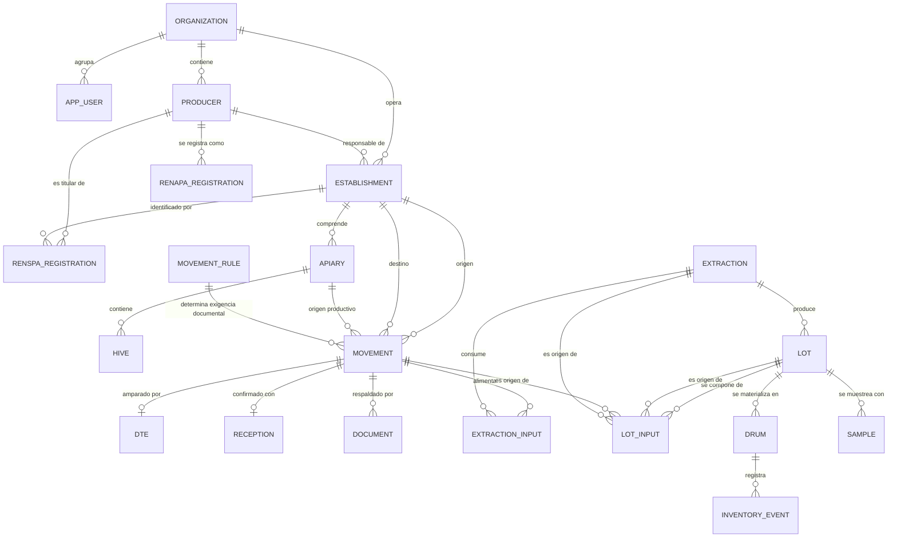
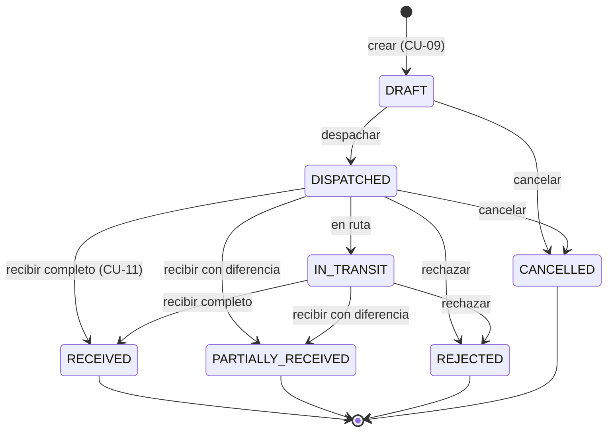
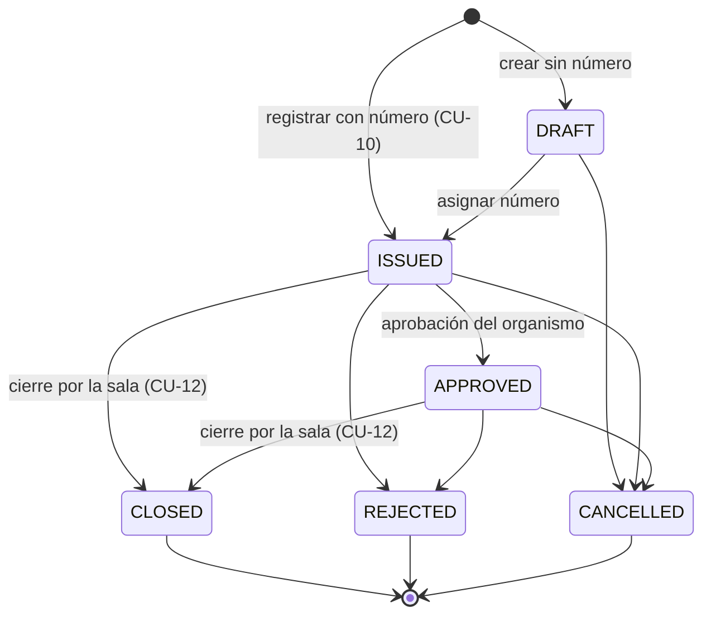
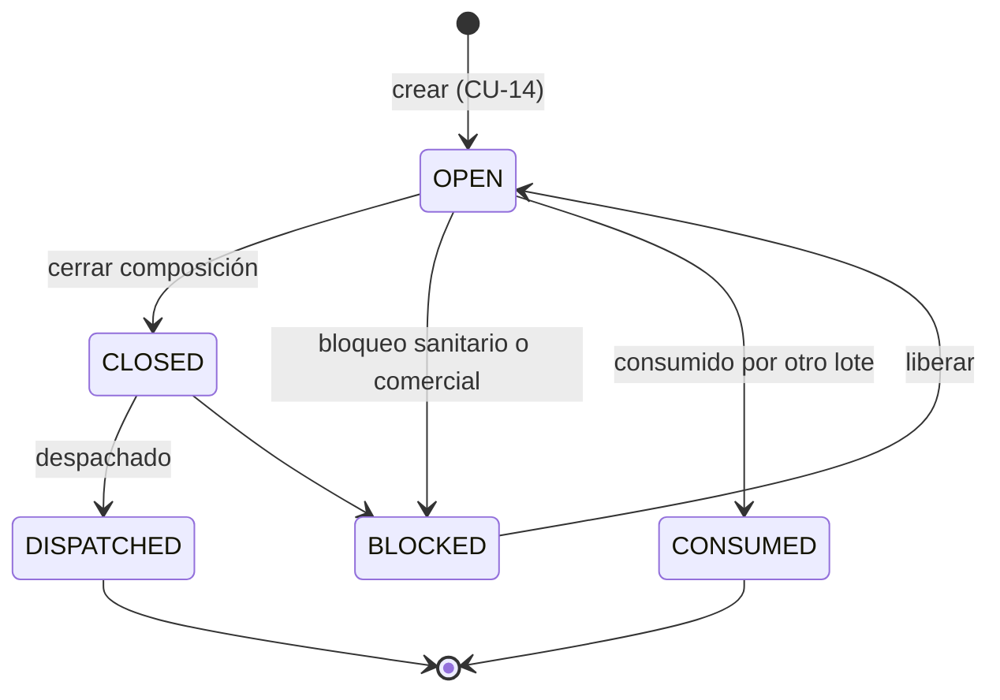
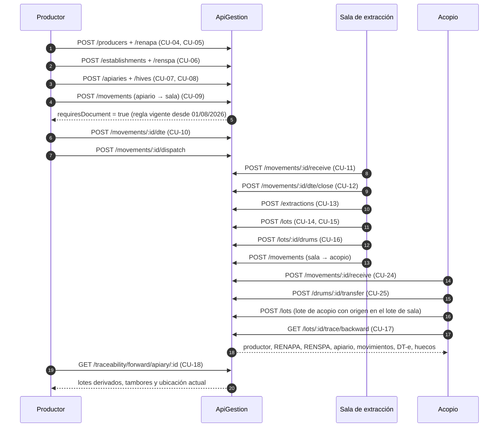

# Definición del MVP — ApiGestion

**Versión:** 1.0
**Fecha:** 2026-08-25
**Tipo:** Documento de alcance y especificación del producto mínimo viable
**Precedentes:** 00-Documento de Visión · 01-Mapa del Dominio · 02-Casos de Uso · 03-Arquitectura Técnica
**Estado de implementación:** backend y aplicación web construidos y verificados
**Alcance del MVP:** API REST + aplicación web instalable (PWA) con modo offline

---

## 1. Qué demuestra este MVP

El documento de visión fija el criterio: el MVP no resuelve toda la cadena
apícola, sino que **demuestra que es posible construir una trazabilidad digital
consistente**. Concretamente, que la plataforma puede responder dos preguntas
sobre datos reales:

> ¿De qué apiario, de qué RENSPA y de qué productor vino la miel de este tambor?

> ¿Dónde terminó la producción de este apiario?

Todo lo demás —integraciones oficiales, facturación, exportación, laboratorio—
depende de que esas dos preguntas tengan respuesta. Por eso son el corazón del
alcance y el criterio de aceptación.

---

## 2. Alcance cerrado

### 2.1 Dentro del MVP

| CU | Caso de uso | Estado |
|---|---|---|
| CU-01 | Registrar usuario | Implementado |
| CU-02 | Autenticar usuario | Implementado |
| CU-03 | Administrar roles y permisos | Implementado |
| CU-04 | Registrar productor | Implementado |
| CU-05 | Asociar RENAPA al productor | Implementado |
| CU-06 | Registrar establecimiento / RENSPA | Implementado |
| CU-07 | Registrar apiario | Implementado |
| CU-08 | Administrar colmenas | Implementado |
| CU-09 | Crear movimiento | Implementado |
| CU-10 | Gestionar DT-e | Implementado (registro y estados; sin integración SIGSA) |
| CU-11 | Recibir movimiento | Implementado |
| CU-12 | Cerrar DT-e | Implementado |
| CU-13 | Registrar extracción | Implementado |
| CU-14 | Crear lote | Implementado |
| CU-15 | Asociar entradas a lote | Implementado |
| CU-16 | Registrar tambor | Implementado |
| CU-17 | Trazabilidad hacia atrás | Implementado |
| CU-18 | Trazabilidad hacia adelante | Implementado |
| CU-19 | Historial de una entidad | Implementado |
| CU-21 | Registrar muestra | Implementado (básico) |
| CU-24 | Recepción en acopio | Implementado (vía movimiento + lote de acopio) |
| CU-25 | Transferir lote/tambor entre ubicaciones | Implementado |
| CU-33 | Registrar evento de auditoría | Implementado (automático) |
| CU-34 | Consultar auditoría | Implementado |

**Agregado sobre el análisis original:** motor de reglas documentales
configurables y versionadas (`movement_rule`). No estaba entre los casos de uso,
pero la arquitectura lo pide en sus secciones 71 y 72 y sin él la exigencia de
DT-e quedaría hardcodeada. Ver sección 6.

### 2.1.1 Aplicación web instalable con modo offline

El MVP incluye la interfaz de usuario, no solo la API. Tres capacidades que no
estaban en los casos de uso originales pero que el uso real exige:

| Capacidad | Por qué está en el MVP |
|---|---|
| **Instalable** | Se agrega a la pantalla de inicio y abre como una aplicación, sin barra de navegador |
| **Lectura sin conexión** | El apiario puede no tener cobertura; lo ya consultado sigue disponible, con aviso de su antigüedad |
| **Escritura sin conexión** | La cosecha se registra donde ocurre. Las operaciones entran en cola y se envían al recuperar señal |

La garantía central del modo offline es que **reenviar una operación encolada
nunca duplica un registro**: la clave de idempotencia se genera en el
dispositivo al encolar y se reutiliza en cada reintento, de modo que si el envío
original llegó al servidor y solo se perdió la respuesta, el backend devuelve la
respuesta original en lugar de crear un segundo movimiento.

Detalle de diseño y sus consecuencias: ADR-010 y ADR-011.

### 2.2 Fuera del MVP, con la puerta abierta

| Qué | Por qué queda fuera | Qué ya está preparado |
|---|---|---|
| Integración viva con SIGSA / DT-e | Requiere credenciales, homologación y contrato oficial | `sync_status`, `external_id`, `external_status`, `last_sync_at`, tabla `integration_event` y outbox listo para el worker |
| Integración con ARCA | Fase 3 según la visión | `tax_id` separado del identificador interno |
| Integración con SIFeGA (RNE/RNPA) | Depende de jurisdicciones integradas | Campo `rne` en establecimiento; `document` admite el tipo |
| Resultados de laboratorio (CU-22, CU-23) | La muestra es el gancho; el resultado es Fase 2 | Tabla `sample` con estados y relación a lote/tambor |
| Fraccionamiento y producto final (CU-26) | Fase 3 | `lot_type = FRACCIONAMIENTO` y grafo de lotes ya soporta la cadena |
| Facturación electrónica (CU-29) | Fase 3 | — |
| QR público (CU-20) | Fase 2 | Códigos legibles y estables por entidad |
| Object storage de documentos | El binario no va en PostgreSQL | `document` guarda `object_key`, `hash`, `mime_type`, `size_bytes` |
| PostGIS | Innecesario para el volumen inicial | Latitud/longitud en `numeric(9,6)`; migrar a `geometry` es aditivo |
| Portal público de trazabilidad por QR | Necesita SEO y enlaces compartibles: es otra aplicación | Códigos legibles y estables por entidad |
| Resolución de conflictos de edición concurrente | El modelo es casi append-only; hoy no hay conflictos reales | La cola conserva el orden de registro (ver ADR-011) |
| Aplicación móvil nativa | La instalable cubre el caso de campo | Manifiesto, service worker y captura de coordenadas ya funcionan |
| Detección de inconsistencias (CU-35) | Fase 2 | El motor de trazabilidad ya devuelve `gaps` |

---

## 3. Modelo de datos

### 3.1 Núcleo de trazabilidad



La entidad clave del grafo es **`LOT_INPUT`**. Es la arista que permite recorrer
la cadena hacia atrás y hacia adelante: un lote puede componerse de movimientos
recibidos, de una extracción o de otros lotes, y esas cadenas tienen profundidad
desconocida. De ahí que las consultas usen CTE recursivas.

### 3.2 Las cinco separaciones que el modelo no negocia

| Se separa | De | Por qué importa |
|---|---|---|
| `producer` | `renapa_registration` | Un productor puede no tener RENAPA todavía, o tener su registro suspendido, sin dejar de existir |
| `renapa_registration` | `renspa_registration` | Registran cosas distintas: la actividad apícola y el par titular-predio |
| `renspa_registration` | `apiary` | Un RENSPA identifica el predio; los apiarios son unidades productivas dentro de él |
| `movement` | `dte` | El movimiento es del dominio; el DT-e es un documento oficial que puede cambiar de forma, de sistema o de exigencia |
| `lot` | `drum` | El lote es lógico y el tambor físico; sus cantidades se validan entre sí pero no son la misma cosa |

Cada separación tiene su prueba automatizada correspondiente.

### 3.3 Identificadores

Toda entidad tiene UUID interno. Los identificadores oficiales viven en columnas
propias con `external_system`, `external_id`, `sync_status` y `last_sync_at`.
Ningún identificador de organismo es clave primaria: si SENASA renumera, el
modelo no se rompe.

---

## 4. Máquinas de estado

### 4.1 Movimiento



Reglas que hace cumplir el backend:

- No se despacha si la regla vigente exige un documento y el documento no existe
  o no está `ISSUED`/`APPROVED`.
- Solo la organización de destino registra la recepción.
- Una diferencia de cantidad exige `discrepancyNotes`: la merma se documenta, no
  se corrige en silencio.
- Origen y destino no pueden ser el mismo establecimiento.

### 4.2 DT-e



El cierre exige que el movimiento esté recibido: cerrar el documento de un
material que nunca llegó rompería exactamente la garantía que el documento
pretende dar. En el esquema informado por SENASA para 2026, el titular del
apiario gestiona el DT-e en SIGSA y la sala de extracción realiza el cierre.

**`sync_status` es independiente del estado interno.** Un DT-e puede estar
`CLOSED` internamente y `PENDING_SYNC` con el organismo. La plataforma sigue
operando y el motor de trazabilidad lo reporta como hueco.

### 4.3 Lote



Solo un lote `OPEN` admite nuevas entradas. Consumir un lote descuenta su
`available_quantity`: sin ese control, la misma miel podría repartirse entre
lotes que sumen más de lo que existió.

---

## 5. Flujo completo de la demostración



Este flujo está automatizado en el seed (`npm run db:seed`) y verificado en la
suite e2e.

---

## 6. Motor de reglas documentales

La arquitectura advierte en su sección 71 contra hardcodear la normativa. La
tabla `movement_rule` la expresa como dato con vigencia:

| Campo | Uso |
|---|---|
| `movement_type`, `material_type`, `origin_type`, `destination_type` | Criterios de coincidencia. `NULL` actúa como comodín |
| `requires_document`, `required_document_type` | Qué exige la regla |
| `effective_from`, `effective_to` | Vigencia normativa |
| `priority` | Gana la regla más específica (valor menor) |
| `legal_reference` | Norma que la respalda, para auditoría |

Reglas cargadas por el seed:

| Prioridad | Regla | Vigencia | Exige |
|---|---|---|---|
| 10 | Material melario, apiario → sala de extracción | desde 01/08/2026 | DT-e |
| 100 | Miel a granel entre establecimientos | desde 01/01/2020 | Remito |
| 900 | Comodín general | desde 01/01/2020 | — |

**La evaluación usa la fecha del movimiento, no la fecha de carga.** Un traslado
del 15/07/2026 cargado hoy no exige DT-e, porque en esa fecha la norma no regía.
Esto tiene su prueba automatizada: el mismo traslado con dos fechas distintas
produce dos decisiones distintas.

Cambiar la normativa es un `INSERT` con nueva vigencia, no un deploy.

---

## 7. Contrato de API

Base: `/api/v1`. Autenticación `Bearer`. OpenAPI navegable en `/docs`.

### Convenciones

- Los `POST` que crean entidades aceptan `Idempotency-Key`. Un reintento con la
  misma clave devuelve la respuesta original con `idempotent-replay: true`.
- Todas las respuestas llevan `x-correlation-id`, propagado a eventos y auditoría.
- Los listados devuelven `{ data, meta: { page, pageSize, total, totalPages } }`.
- Los errores devuelven `{ statusCode, error, message, correlationId, path, timestamp }`.

### Respuesta de trazabilidad

```jsonc
{
  "direction": "backward",
  "root":    { "type": "lot", "id": "...", "label": "LOTE-2026-000002" },
  "nodes":   [ /* productor, renapa, renspa, establecimiento, apiario, movimiento, dte, recepción, extracción, lote, tambor */ ],
  "edges":   [ { "from": "lot:...", "to": "extraction:...", "relation": "proviene de la extraccion" } ],
  "summary": { "producers": [...], "renspa": [...], "apiaries": [...], "movements": [...], "lots": [...], "drums": [...] },
  "gaps":    [ { "severity": "WARNING", "code": "DTE_PENDING_SYNC", "message": "..." } ],
  "complete": true,
  "generatedAt": "2026-08-25T18:00:00.000Z"
}
```

`gaps` es el aporte menos obvio y el más útil en operación: la trazabilidad rara
vez está completa, y la plataforma dice **qué falta** en lugar de fingir que no
falta nada.

| Código de hueco | Severidad | Significado |
|---|---|---|
| `LOT_WITHOUT_INPUTS` | WARNING | El lote no declara origen; la cadena no puede reconstruirse |
| `MISSING_REQUIRED_DOCUMENT` | ERROR | La regla exigía un documento que no se registró |
| `DTE_PENDING_SYNC` | WARNING | El DT-e no está sincronizado con SIGSA |
| `RECEPTION_DISCREPANCY` | WARNING | La cantidad recibida difiere de la declarada |
| `ESTABLISHMENT_WITHOUT_RENSPA` | WARNING | Establecimiento sin identificación sanitaria |
| `PRODUCER_WITHOUT_RENAPA` | WARNING | Titular de predio apícola sin RENAPA |

---

## 8. Seguridad

| Control | Implementación |
|---|---|
| Autenticación | JWT de acceso (30 min) + refresh opaco rotativo (14 días), guardado hasheado con HMAC |
| Autorización por rol | RBAC declarativo con `@Roles`; ADMIN nunca queda excluido por omisión |
| Autorización contextual | Cada consulta se limita a la organización del usuario; un movimiento es visible desde origen y destino |
| Solo lectura | AUDITOR y CONSULTA no escriben, aunque el rol pase el filtro del endpoint |
| Revalidación por request | El estado y el rol se releen de la base: un token válido no habilita una cuenta suspendida |
| Enumeración de usuarios | Mismo mensaje y tiempo de respuesta ante correo inexistente o clave incorrecta |
| Contraseñas | bcrypt, 12 rondas, mínimo 10 caracteres |
| Idempotencia | Clave + hash del cuerpo; reutilizarla con otro cuerpo devuelve 409 |
| Rate limiting | 240 req/min por IP, configurable |
| Cabeceras | Helmet |
| Validación | Whitelist estricta: un campo no declarado se rechaza, no se ignora |
| Auditoría | Tabla independiente; nunca hace fallar la operación de negocio |
| Secretos | Solo por variable de entorno; el arranque falla si faltan o son débiles |

---

## 9. Criterios de aceptación

Los criterios del documento de visión, con su verificación:

| Criterio | Verificación |
|---|---|
| Un usuario puede registrar su identidad | e2e: registro, login, refresh, rechazo de credenciales |
| Un establecimiento queda asociado a un productor | e2e: CU-06 con RENSPA |
| Un RENSPA se identifica como origen o destino de un movimiento | e2e: el DT-e toma el RENSPA vigente de cada extremo |
| Un apiario queda asociado a su establecimiento | e2e: CU-07 y rechazo de duplicados |
| Un lote se relaciona con su origen | e2e: la arista a la extracción se agrega sola |
| Un tambor se relaciona con un lote | e2e: control de suma de pesos y de neto vs bruto-tara |
| Un movimiento puede consultarse | e2e: visible desde ambos extremos, oculto a terceros |
| La trazabilidad se recorre en ambos sentidos | e2e: hacia atrás desde lote y tambor; hacia adelante desde apiario |
| Las operaciones quedan auditadas | e2e: consulta de auditoría con actor, acción y entidad |
| La arquitectura permite agregar integraciones | Estados de sincronización, outbox y `integration_event` ya en el esquema |

**Estado del backend:** 39 pruebas e2e contra PostgreSQL real y 17 unitarias,
todas en verde.

**Estado del frontend:** 15 pruebas de la capa offline (caché, cola de envío,
idempotencia, orden y corte de red) más una prueba de navegador de punta a punta
que verifica el ciclo completo:

| Verificación | Resultado |
|---|---|
| Inicio de sesión y carga del panel | Correcto |
| Grafo de trazabilidad hacia atrás | 20 nodos, 18 relaciones, detalle por nodo |
| Recarga **sin conexión** | La aplicación abre desde el precaché y muestra los datos locales |
| Formulario offline con listas cacheadas | Correcto |
| Registro de un movimiento sin señal | Queda en cola con aviso explícito |
| Reconexión | La cola se vacía sola y el movimiento llega al servidor |

---

## 10. Dependencias técnicas

| Dependencia | Versión | Criticidad | Nota |
|---|---|---|---|
| Node.js | 22 LTS | Alta | Soporte hasta abril 2027 |
| PostgreSQL | 16+ (Neon sirve 18.6) | Alta | CTE recursivas y `FOR UPDATE SKIP LOCKED` son requisitos duros |
| Neon | — | Alta | Proveedor de la base. Migrar a otro PostgreSQL es cambiar `DATABASE_URL` |
| NestJS | 11 | Alta | Reemplazarlo implicaría reescribir controladores y módulos |
| Drizzle ORM | 0.44 | Media | Sin motor binario; migrar a otro ORM tocaría la capa de acceso a datos |
| React + Vite | 19 / 6 | Alta | Base de la aplicación web |
| vite-plugin-pwa (Workbox) | 1.0 | Media | Genera el service worker; reemplazable por uno propio |
| IndexedDB (`idb`) | 8 | Alta | Sostiene todo el modo offline |
| Render | — | Media | El blueprint es específico; el Dockerfile permite mover la app a cualquier plataforma |
| SENASA/SIGSA | — | **Externa** | Sin contrato de integración público. El adaptador es trabajo futuro con riesgo de alcance |
| ARCA · SIFeGA | — | **Externa** | Ídem, en fases posteriores |

---

## 11. Riesgos

| # | Riesgo | Impacto | Mitigación implementada | Pendiente |
|---|---|---|---|---|
| 1 | El contrato real de SIGSA difiere de lo previsto | Alto | Modelo canónico + adaptador aislado + estados de sincronización | Obtener documentación y credenciales oficiales |
| 2 | La normativa cambia | Medio | Reglas versionadas por vigencia | Definir quién carga y aprueba las reglas |
| 3 | Límites del plan gratuito de Neon | Medio | Sin expiración a 30 días, a diferencia de Render; pool acotado a 5 conexiones | Vigilar el cómputo mensual antes de cargar datos reales |
| 4 | El servicio free de Render duerme tras 15 min | Bajo | Health check liviano; el frontend es static site y no duerme, así que muestra datos locales mientras la API despierta | Plan `starter` o ping externo |
| 5 | Crecimiento del grafo de trazabilidad | Medio | Índices sobre `lot_input`, corte de ciclos, límite de profundidad | Medir con volumen real; evaluar OpenSearch en Fase 3 |
| 6 | Duplicación por reintentos de red | Medio | Idempotencia en los comandos de creación | Extender a los endpoints de cambio de estado |
| 7 | El outbox entrega en proceso | Medio | `FOR UPDATE SKIP LOCKED` permite varias instancias; backoff exponencial | Migrar a RabbitMQ cuando haya integraciones reales |
| 8 | Los binarios de documentos no se almacenan | Medio | `document` guarda metadatos y `object_key` | Integrar S3 o MinIO en Fase 2 |
| 9 | Cuenta de servicio comprometida | Alto | RBAC + autorización contextual + auditoría + refresh rotativo | MFA al migrar a OIDC |
| 10 | Multi-tenancy por `organization_id` en la aplicación | Medio | Filtrado centralizado en un único servicio | Evaluar Row Level Security de PostgreSQL como segunda barrera |
| 11 | Sesión en `localStorage` para sobrevivir a una recarga sin red | Medio | Token de acceso de 30 min y refresh rotativo del lado del servidor | Migrar a OIDC con MFA (iteración 5) |
| 12 | Datos locales desactualizados mientras la cola espera | Medio | La interfaz avisa la antigüedad de cada dato servido del caché | Mostrar además qué registros aún no llegaron al servidor |
| 13 | Operación encolada rechazada por el servidor | Bajo | Deja de reintentarse, queda visible en `/pending` con el motivo | Notificación al usuario cuando ocurre en segundo plano |

---

## 12. Próximas iteraciones

### Iteración 2 — Integración sanitaria y documentos

Adaptador SENASA/SIGSA con anti-corruption layer, worker de sincronización sobre
el outbox, circuit breaker y reintentos; object storage para los binarios;
resultados de laboratorio (CU-22, CU-23); portal público de trazabilidad por QR
(CU-20), como aplicación aparte porque necesita SEO; detección automática de
inconsistencias (CU-35) a partir de los `gaps`.

### Iteración 3 — Comercial y alimentario

Adaptador ARCA para identidad fiscal y facturación electrónica; adaptador SIFeGA
para RNE/RNPA; fraccionamiento y producto final (CU-26, CU-27); operación
comercial (CU-28).

### Iteración 4 — Exportación y escala

Expediente de exportación (CU-36, CU-37); separación OLTP/consulta con
OpenSearch; réplicas de lectura; extracción del módulo de trazabilidad a
servicio propio si la carga lo justifica.

### Iteración 5 — Campo y analítica

Lectura de QR con la cámara del dispositivo; migración a OIDC con MFA; PostGIS
para consultas geográficas; analítica y detección predictiva. Evaluar
notificaciones push para avisar de una operación encolada que el servidor
rechazó.

---

## 13. Documentos relacionados

| Documento | Contenido |
|---|---|
| `00-Documento_de_Vision...md` | Problema, usuarios, objetivos |
| `01-Mapa_del_Dominio...md` | Modelo conceptual y reglas de modelado |
| `02-Casos_de_Uso...md` | Análisis funcional por caso de uso |
| `03-ArquitecturaTecnica...md` | Arquitectura de referencia |
| **`04-MVP-ApiGestion.md`** | Este documento: alcance, modelo, contrato y riesgos |
| `05-ADR-Decisiones-Tecnicas.md` | Decisiones que se apartan de la arquitectura de referencia, con su justificación |
| `backend/README.md` | Guía operativa de la API: instalación, comandos, despliegue |
| `frontend/README.md` | Cómo funciona el modo offline y la instalación en el dispositivo |
